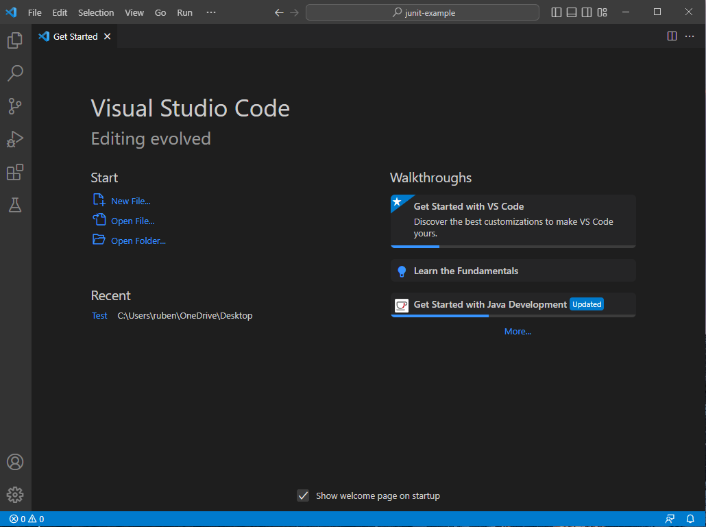
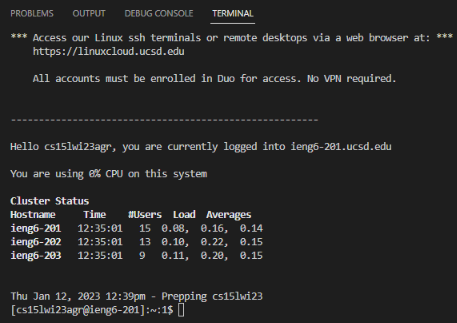
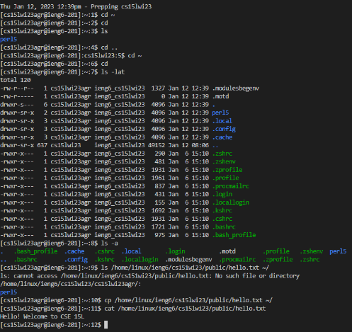

# Lab Report 1
**Bold** Part 1-Set up you CSE15L Account
[Link](https://sdacs.ucsd.edu/~icc/index.php)
[TUTORIAL] (https://docs.google.com/document/d/1hs7CyQeh-MdUfM9uv99i8tqfneos6Y8bDU0uhn1wqho/edit)

**Part 2-Using Visual Studio Code**
In order to use Visual Studio Code you must install it in your computer.
There are different versions for all all OS devices.
*Make sure to download the latest version*
[Link](https://code.visualstudio.com/)

If downloaded correctly, it should look something like this...

**Part 3-Remotely Connecting**
[Using Bash on Windows in VScode](https://stackoverflow.com/questions/42606837/how-do-i-use-bash-on-windows-from-the-visual-studio-code-integrated-terminal/50527994#50527994)
To use ssh you must open a terminal in VScode. (Ctrl or Command + ', or use the Terminal->New Terminal menu option).
$ ssh cs15lwi23zz@ieng6.ucsd.edu
The zz replaced by the letter in your course-specific account.
After successfully signing in you'll be asked a yes or no question. So type yes and press enter.
Once entered you'll be asked to type in your password.
**Remember: Don't panic if you can't see your password being typed! It's suppose to do that**
*Once you log in your terminal it should look something like:* 

*If you see this on your screen then your terminal has successfully connected to a computer in the CSE basement and the commands you enter will run on that computer.*
**You're in**

**Part 5-Run Some Commands**
Try running the commands...
cd: Allows you to move between directories
ls: List
pwd: print working directory
mkdir: Creates a directory or subdirectory
cp: copy
*Here are other specific useful commands to try:*
- cd ~
- cd
- ls -lat
- ls -a
- ls <directory> where <directory is /home/linux/ieng6/cs15lwi23/cs15lwi23abc, where the abc is one of the other group member's username
- cp home/linux/linux/ieng6/cs15lwi23/public/hello.txt ~/
- cat /home/linux/ieng6/cs15lwi23/public/hello.txt

 *You should see something like this*
  

  
 *To log out of the remote server in your terminal use:*
  - Ctrl-D
  -Run the command exit
